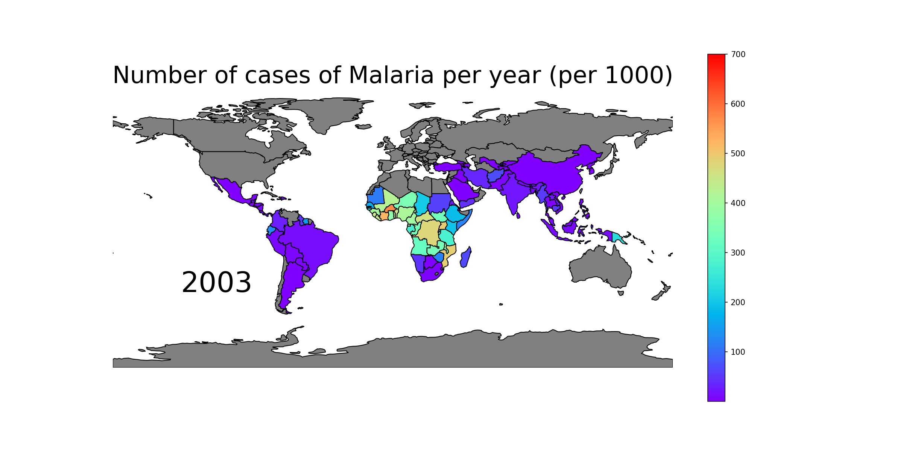

# Malaria Maps

Generate PNGs of malaria cases on a continent or the world map for the years in the dataset.

## Requirements

- Conda (with Python 3.7+), and:
  - numpy
  - pandas
  - matplotlib
  - geopandas
  - geoplot

## Installation

1. [Install Conda](https://docs.conda.io/projects/conda/en/latest/user-guide/install/index.html) (recommended: Anaconda)

2. Create a Conda environment using the `environment.yml` file

```
conda env create -f environment.yml
```

3. Activate the Conda environment

```
conda activate malaria-project-1.0.0
```

## Usage

```
usage: malaria.py [-h] [--geography GEOGRAPHY] [--dpi DPI]
                  [--figsize FIGSIZE [FIGSIZE ...]]

Make a figure of malaria cases on a continent or the world for the years in
the dataset

optional arguments:
  -h, --help            show this help message and exit
  --geography GEOGRAPHY
                        Africa, Asia, Europe, South America, North America, or
                        World (default is World)
  --dpi DPI             DPI value
```

## Examples

```
python malaria.py --geography Africa --dpi 300
```
Generates an image for each year in the dataset of Africa and malaria incidence per 1000 pop at risk.

"World" output example:


## Data files

`incidence_per_1000_pop_at_risk.csv`: obtained from https://www.kaggle.com/imdevskp/malaria-dataset

`correct_names.csv`: created to properly match names between the Geopandas `naturalearth_lowres` dataset and the above malaria database

## License

MIT License
